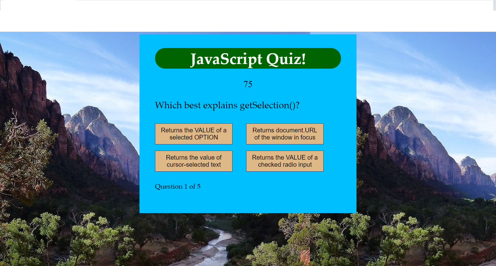

Purpose: The purpose of this website is to see how knowledgeable one is with JavaScript. It is a short quiz composed of 5 questions to test the user's knowledge on the subject. When you choose the correct answer, your score is saved and then at the end of the quiz you will get a score of between 0 and 5 depending on how many questions you got right. It also has a 75 second timer on it, to add a little extra challenge.

Current author: Maintenance and further contributions are made by Christopher Gonzalez.

Link for deployed website: 

[Website] (https://spiralout92.github.io/JavaScript-Quiz/)

Link for deployed website image: 

